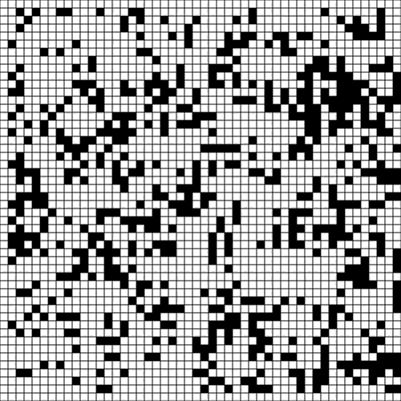
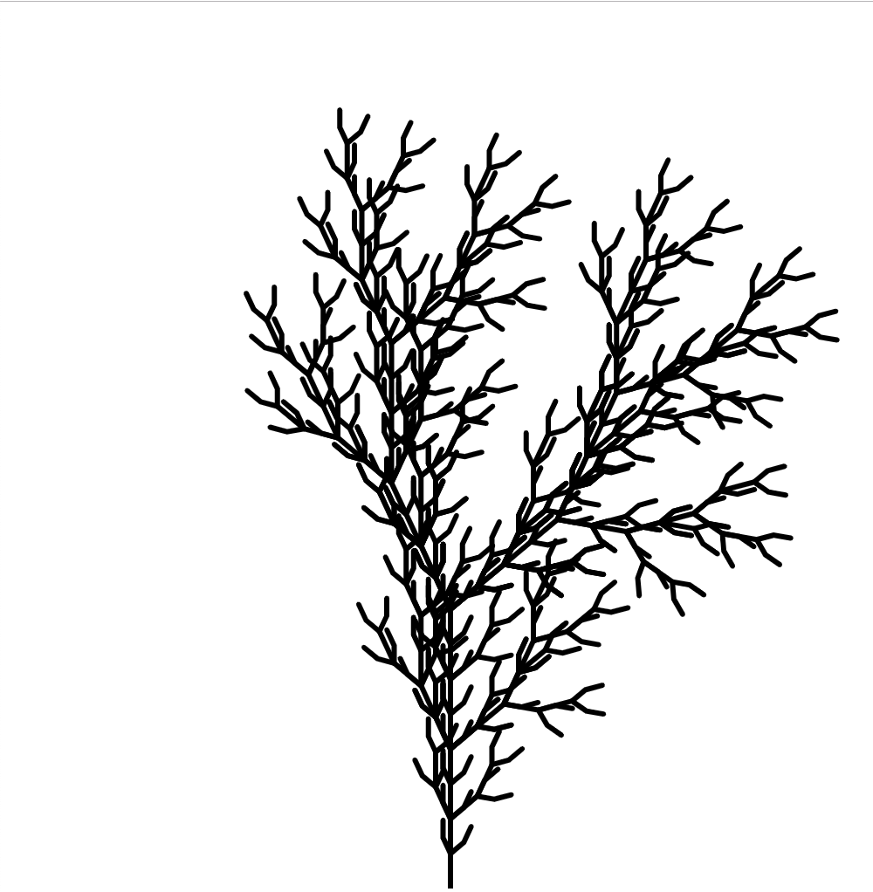
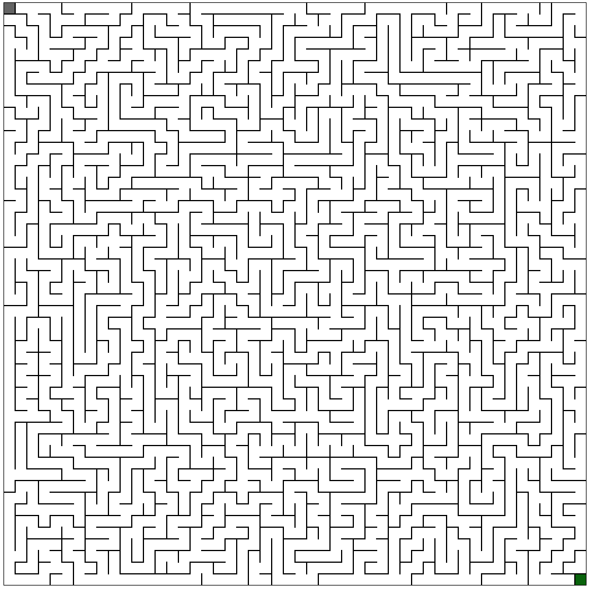
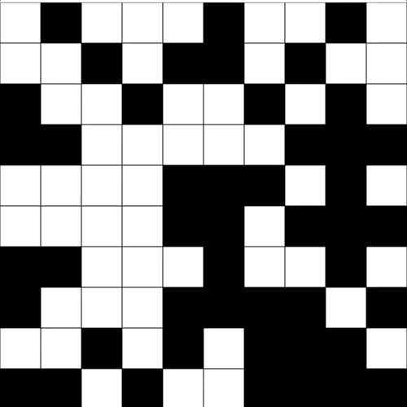
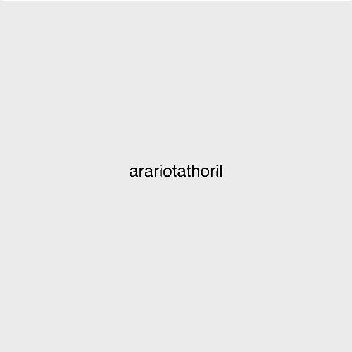

This repository contains examples (in p5.js) implemented during the University of California, Santa Cruz - CMPM147 - Generative Design
course and base code for programming assignments.

# CMPM147 - Generative Design

This course introduces the students to fundamental methods of Generative Arts and Design.
The first half of the course focus on both constructive and search-based approaches and the second half
focus on data-driven approaches, mainly using Neural Network techniques. Every week we discuss a new method,
including how to apply them to generate artifacts in domains such as visual arts, music, narrative,
video games, etc.  Methods are implemented in Javascript with P5.js (Processing).

## Examples

This is a handson course where we implement the "vanilla" version of the methods in class with simple
applications. In this repository, you can find all the code implemented in the last version of this course (Summer 19):

## Lectures

* L01 - Introduction
* L02 - Javascript, Processing and p5.js
* L03 - Randomnes and Noise

* L04 - Cellular Automata

* L05 - Generative Grammars

* L06 - Search

* L07 - Evolutionary Algortihms

* L08 - Markov Chains

* L09 - Perceptron

* L10 - Multilayer Perceptron

* L11 - TensorFlow.js
* L12 - Recurrent Neural Networks
* L13 - Autoencoders
* L14 - GANs

## Assignments

* ASG1 - Music Visualization with Particle System
* ASG2 - Terrain Generation with Perlin Noise
* ASG3 - Interactive Artist NPC with Generative Grammars
* ASG4 - Evolving Cars
* ASG5 - Music with Markov Chains

## TODO

* L06 - Include planning (for narrative) and ASP.
* L07 - Improve GA to generate SMB levels.
* L14 - Implement simple GAN for digit generation.

* ASG2 - Include base code with optimized renderer to support large worlds.
* ASG4 - Change description to require Tournament selection instead of Roulette Wheel.
* ASG5 - Change description to generate monophonic music instead of polyphonic.
